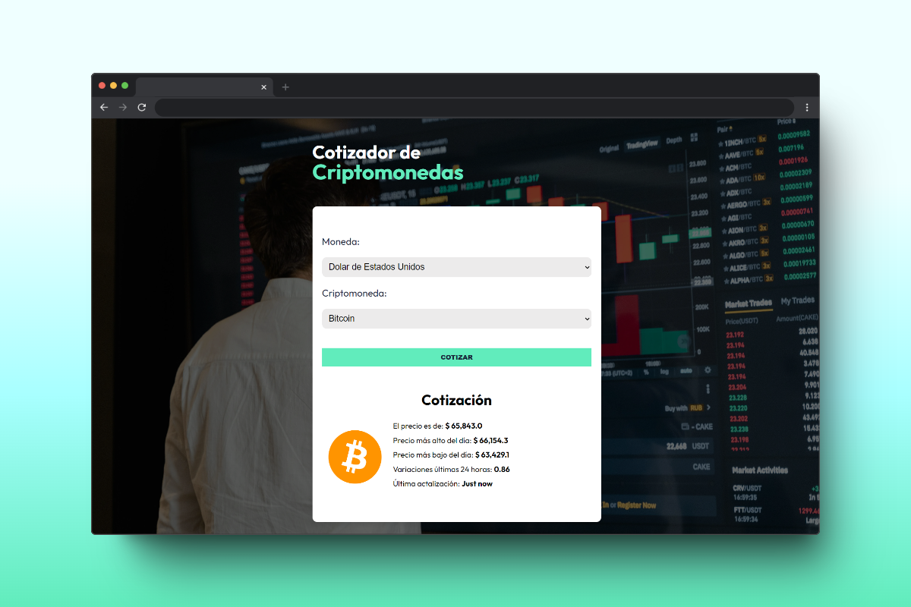
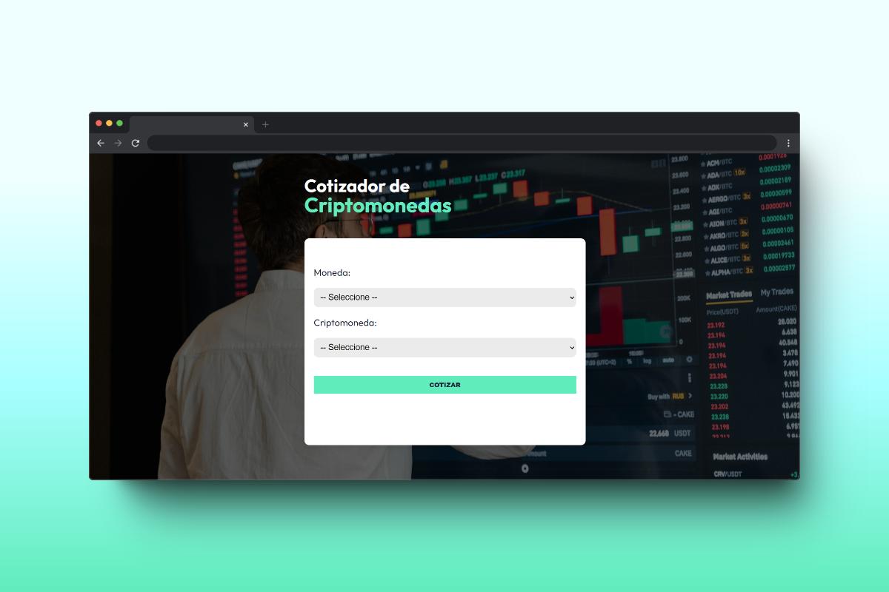
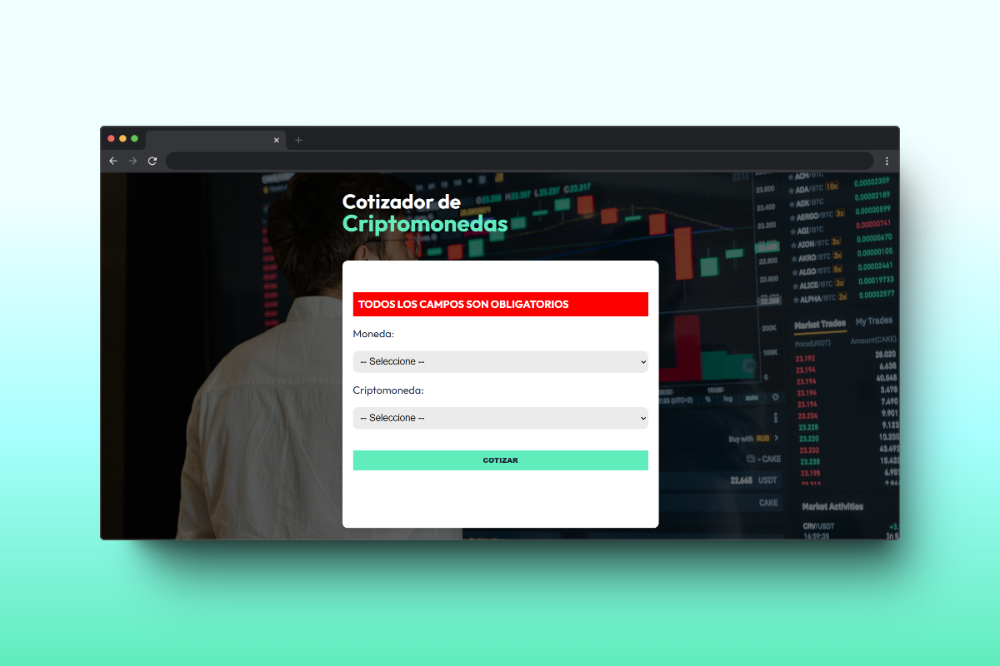

# 📈 Crypto Quoter

## 📖 Project Overview

Crypto Quoter is a web application where you can check the real-time price of the top 100 cryptocurrencies.

## 🎨 Project Features

-   **Real-time Prices:** Get updated prices of the top 100 cryptocurrencies in real time.
-   **Currency Conversion:** View cryptocurrency prices in american dollar, mexican peso, euros and british pound.
-   **Responsive Design:** Optimized for both desktop and mobile devices for seamless user experience.
-   **Data Validation:** Using Zod to ensure data integrity and validity.
-   **State Management:** Zustand for managing global state across the application.

## 🛠️ Technologies Used

## 📄 Additional Resources

-   **Typography**: Utilized Google Fonts for the project's typography.

## 🌐 API Used

The API utilized for this project is [CryptoCompare](https://min-api.cryptocompare.com/).

## 📦 Libraries Used

-   [Zustand](https://www.npmjs.com/package/zustand)

## 📚 What I Learned

In this project, I learned how to connect to an API to fetch cryptocurrency prices in various currencies. I also used Zustand for state management and Zod for validating the responses received from our API.

## 🖼️ Screenshots

### Error message if user donsen't adds a currency or cryptocurrency

## 📬 Contact Information

